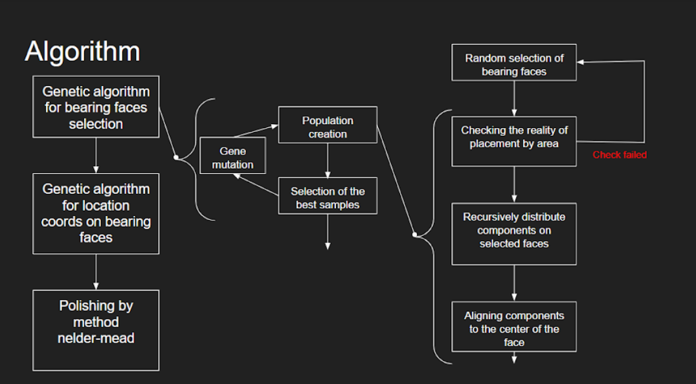
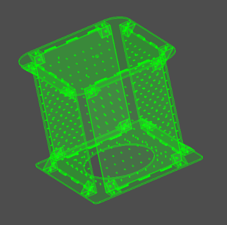
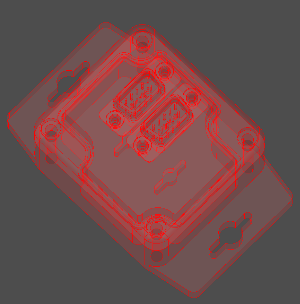

# A practical satellite layout optimization design approach based on evolution algorithm with polishing Nelder-mead

The satellite layout optimization design (SLOD) problem is proposed as an automatic approach to generate better layout candidate schemes for engineers to choose from. It is addressed as a three-dimensional packing problem with behavioral constraints, which has been proven as an NP-hard problem theoretically.
The goal of optimization is the non-intersection of components, minimization of deviations of the mass center, and axes of inertia. 
To solve this problem, it is proposed to use a two-epochs genetic algorithm (GA) with polishing. In the first epoch, bearing faces for component and rotation are selected. In the second epoch, location coords on the bearing face are selected. And in the polishing, where the Nelder-Mead method is used, location coords are corrected. 

# Features:
* To find the correct locations on the bearing faces during the first GA epoch, an allocation algorithm is used that excludes intersections of components on one face.
* During the passage of two GA epochs, new gene populations are composed only by mutation: in the first epoch, mutation for index face variables, and in the second, for location coords variables.
* If, before using the allocation algorithm, the area check shows that distribution is not possible, a new gene is generated which is also checked before placement.
* The objective function is calculated using PythonOCC, which allows you to work with STEP files, calculate intersections and interferences, mass and inertial characteristics, as well as display the result and parallelize calculations.

# Test example

As a test case study satellite “orbitcraft” with 16 components are proposed.
|Frame|Component example|
|---|---|
|||

 Work with interface:

